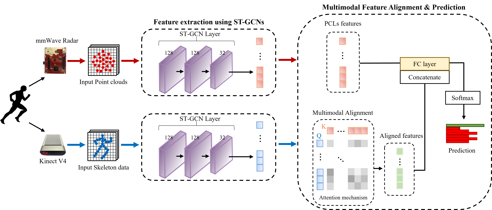

## MTGEA
<div align="center">
    
</div>

## Prerequisites
- Python3 (>=3.7)
- PyTorch (>=1.6)
- Other Python libraries can be installed by `pip install -r requirements.txt`


### Installation
``` shell
git clone https://github.com/gw16/MTGEA.git; cd MTGEA
cd torchlight; python setup.py install; cd ..
```

### Data Preparation
- For the dataset, you can download the pre-processed data from [here](https://drive.google.com/file/d/1wBEGb_rIJLsroDIDYG0_OJ_cb8f_MR3Q/view?usp=sharing) and the raw data from [here](https://drive.google.com/file/d/19nnycJ2FcgdqylE0g-a_lzDCq6RZewdD/view?usp=sharing). 

## Training and Testing
To train a MTGEA model, run
```
python main.py recognition -c config/mtgea/<dataset>/train.yaml [--work_dir <work folder for double train>] --phase 'double_train'
```
where the ```<dataset>``` must be [DGUHA_Dataset](https://drive.google.com/file/d/1wBEGb_rIJLsroDIDYG0_OJ_cb8f_MR3Q/view?usp=sharing), and we recommend you to name ```<dataset>``` "dguha_dataset".
As training results, **model weights**, configurations and logging files, will be saved under the ```<work folder for double train>```. (saved ```./work_dir``` by default but not recommended)

After model training, trained model evaluation can be achieved by this command:
```
python main.py recognition -c config/mtgea/<dataset>/test.yaml --weights <path to model weights from double train work folder> --phase 'double_test'
```

Then, fixing the Kinect stream and training the MTGEA model with point clouds alone can be achieved by this command:
```
python main.py recognition -c config/mtgea/<dataset>/test.yaml --weights <path to model weights from double train work folder> --phase 'freezing_train' [--work_dir <work folder for freezing train>]
```
Finally, custom model evaluation can be achieved by this command:
```
python main.py recognition -c config/mtgea/<dataset>/test.yaml --weights <path to model weights from freezing train work folder> --phase 'freezing_test'
```
An example of testing from a pretrained model:
```
python main.py recognition -c config/mtgea/<dataset>/test.yaml --weights '/path/MTGEA/saved_best_model/mtgea_model(with_ahc).pt' --phase 'freezing_test'
```

## Acknowledgement

The our framework is extended from the following repositories. We appreciate the authors for releasing the codes.
- The 2-stream framework of our code is based on [ST-GCN](https://github.com/yysijie/st-gcn/blob/master/OLD_README.md).
```
@inproceedings{stgcn2018aaai,
  title     = {Spatial Temporal Graph Convolutional Networks for Skeleton-Based Action Recognition},
  author    = {Sijie Yan and Yuanjun Xiong and Dahua Lin},
  booktitle = {AAAI},
  year      = {2018},
}
```
- The attention mechanism is based on [Mega](https://github.com/thecharm/Mega).
```
@inproceedings{zheng2021multimodal,
  title={Multimodal Relation Extraction with Efficient Graph Alignment},
  author={Zheng, Changmeng and Feng, Junhao and Fu, Ze and Cai, Yi and Li, Qing and Wang, Tao},
  booktitle={Proceedings of the 29th ACM International Conference on Multimedia},
  pages={5298--5306},
  year={2021}
}

@inproceedings{zheng2021mnre,
  title={MNRE: A Challenge Multimodal Dataset for Neural Relation Extraction with Visual Evidence in Social Media Posts},
  author={Zheng, Changmeng and Wu, Zhiwei and Feng, Junhao and Fu, Ze and Cai, Yi},
  booktitle={2021 IEEE International Conference on Multimedia and Expo (ICME)},
  pages={1--6},
  year={2021},
  organization={IEEE}
}
```
